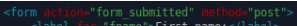

# Week2

## DB Webserver Connection

* create user for remote access:

.png>)

* allow connections through firewall: `sudo ufw allow from 0.0.0.0 to 0.0.0.0 port 3306 proto tcp`
* get python dependencies: `sudo apt update && sudo apt install python3 python3-pip python3-venv`
* `cd /home/champuser/proj/`
* create virtual environment: `python3 -m venv .venv` activate: `. .venv/bin/activate`

install flask: `pip install flask`

Create directory for Flask: `mkdir Flask, cd Flask`

dependencies `pip install Flask-MySQLdb pip install flask-mysql pip install cryptography`

.png>)

.png>)

.png>)

.png>)

if localhost doesn't work, change bind-address in /etc/mysql/mysql.conf.d/mysqld.cnf

## Filter from application

* add form action&#x20;

* add python form processing

&#x20;.png>)

## for pets db

.png>)
