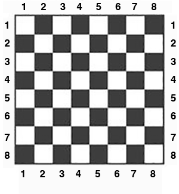

# Statement

Chess bishop moves diagonally in any number of squares. 
Given two different squares of the chessboard, 
determine whether a bishop can go from the first 
square to the second one in a single move.

The function receives four parameters from 1 to 8 each specifying 
the column and the row number, first two - for the first square, 
and the last two - for the second square. 
The function should return True if a Bishop can go from the first 
square to the second one in a single move or False otherwise.

HINT: Use the built-in function `abs()` 
to find the absolute value of a number.  Example `abs(-1)` will return `1`. This can simplify your logic significantly.

If you have never played chess before this video tutorial will help (watch only the first minute):
https://youtu.be/Nr-Bj0u1FRw?t=15

  

# Example function call

```
is_legal_bishop_move(4,4,7,7)
```

# Return Value

```
True
```

