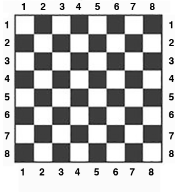

# Statement

Chess king moves one square in any direction. Given two 
different squares of the chessboard, determine whether a king can 
go from the first square to the second one in a single move. Assume
no other pieces are on the board.

The function receives four parameters from 1 to 8 each specifying 
the column and the row number, first two - for the first square, 
and the last two - for the second square. 
The function should return True if a King can go from the first 
square to the second one in a single move or False otherwise.

HINT: While not necessary, you can use the built-in function `abs()` 
to find the absolute value of a number.  Example `abs(-1)` will return `1`.

If you have never played chess before this video tutorial will help (watch only the first 30 seconds):
https://youtu.be/2h3eJ4V1Hcw?t=37

  

# Example input

```
4
4
5
5
```

# Example output

```
YES
```

