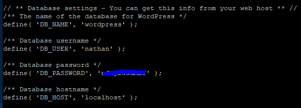

# Lab11 - WordPress on Linux



* connect blog-01 to network (you should be good at this by now)
* remember DNS!
* install [Apache](lab08-apache.md)
* install MySQL

```bash
curl -sSLO https://dev.mysql.com/get/mysql80-community-release-el7-11.noarch.rpm
sudo rpm -ivh mysql80-community-release-el7-11.noarch.rpm
sudo yum update
sudo yum install mariadb-server
sudo systemctl start mariadb
sudo systemctl status mariadb
sudo mysql_secure_installation
ENTER PASSWORD AND CONFIGS
mysql -u root -p
```

* configure WordPress database


```bash
CREATE DATABASE wordpress
CREATE USER nathan@localhost IDENTIFIED BY 'password';
GRANT ALL PRIVILEGES ON wordpress.* TO nathan@localhost IDENTIFIED BY 'password';
FLUSH PRIVILEGES;
exit
```


* install PHP

```bash
yum install http://rpms.remirepo.net/enterprise/remi-release-7.rpm
yum install yum-utils
yum-config-manager --enable remi-php74
yum update
sudo yum install php php-gd php-mysql
php -v
```

* install WordPress

```bash
sudo service httpd restart
cd ~
wget http://wordpress.org/latest.tar.gz
tar xzvf latest.tar.gz
sudo rsync -avP ~/wordpress/ /var/www/html/
sudo chown -R apache:apache /var/www/html/*
```

* configure WordPress

```bash
cd /var/www/html
cp wp-config-sample.php wp-config.php
nano wp-config.php
```

<figure><figcaption></figcaption></figure>

* on WKS, go to http://blog01-nathan/readme.html
* follow the installation steps
