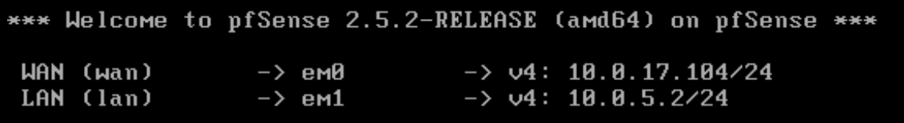
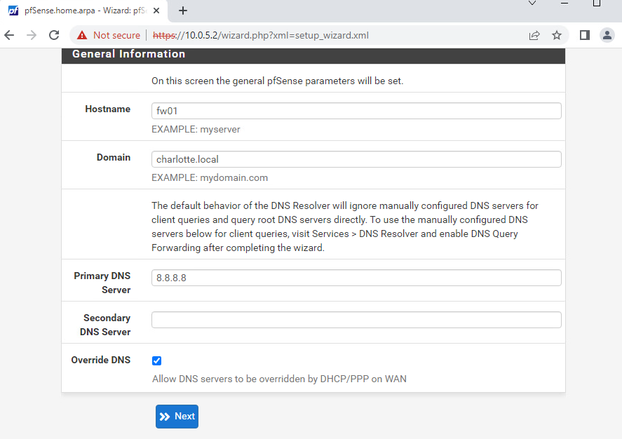
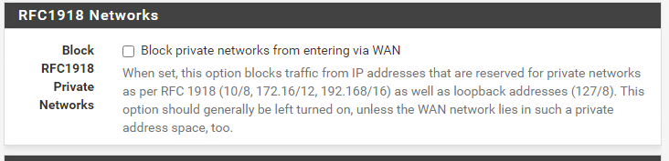

# Lab01 - Environment Setup

## Add a Network Adapters in VSphere:

- Power off the machine
- VM Hardware Section -> Edit
- Add New Device -> Network Adapter
- Change interface to either WAN or LAN

## FW01
Before powering on, check network interface configuration (1:WAN   2:LAN)

Configure IP Addresses
- Should VLANs be set up no: **n**
- Enter the WAN interface name: **em0**
- Enter the LAN interface name:**em1**
- Do you want to proceed:**y**

- Select Option 2 to Set IP Addresses, Pick 1 - WAN em0
- Configure IPv4 address WAN interface via DHCP?: **n**
- Enter your new WAN IPv4 address: **10.0.17.104**
- Enter the new WAN IPv4 subnet bit count: **24**
- For WAN enter the new IPv4 upstream gateway address of **10.0.17.2**
- Configure IPv6 address WAN interface via DHCP6?: **n**
- Enter the new WAN IPv6 address: **<ENTER> for none**
- Do you want to revert to HTTP as the webConfigurator protocol? : **n**
The console screen should now show a static IP address of 10.0.17.104/24 for em0:

Now we need to set the IP address for the other interface em1.
Select Option 2 again.
- Pick interface 2 - LAN (em1)
- Enter the new LAN IPv4 address: **10.0.5.2**
- Enter the new LAN IPv4 subnet bit count: **24**
- For a LAN press <ENTER> for none: **<ENTER>**
- Enter the LAN IPv6 address: **<ENTER>**
- Do you want to enable the DHCP server on LAN?: **n**
- Do you want to revert to HTTP as the webConfigurator protocol? : **n**

### GUI (web)
The default username/password is admin/pfsense

new admin password: password123

## WKS01

### Rename a Windows Computer

* In File Explorer, right-click on “This PC”
* “Properties” -> “Change Settings”
* Click “Change” next to “To rename this computer…”

### Add a user on Windows

* Computer Management -> Local Users and Groups -> Users
* Right Click -> New User

### Add a User to a Group on Windows

* Go to user Properties -> Member Of -> Add
* Type the group name i.e. WKS01-NATHAN\Adminstrators
* Check names, if the text entered is a valid group, the text should underline

### Change IP Address on Windows

* Go to Network and Internet settings -> Change adapter options
* Right-click on network adapter - “properties”
* Double-click IPv4 setting
